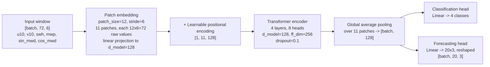
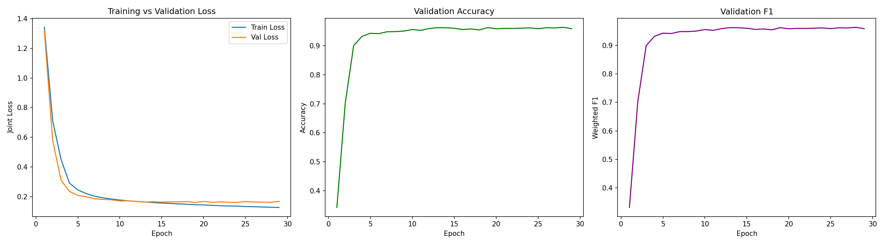
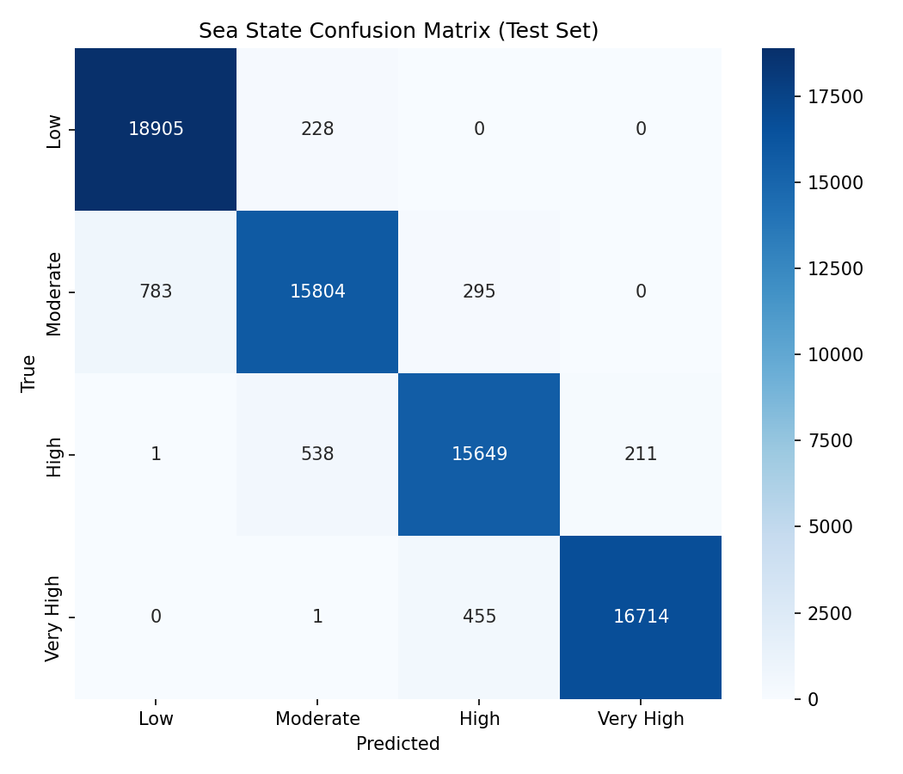
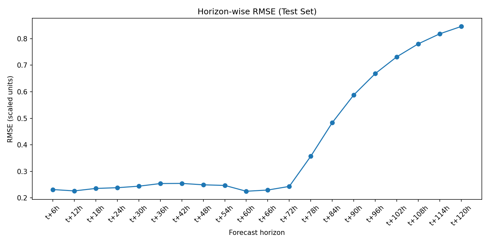

# Atlantic Ocean — PatchTST Wave Forecasting: Documentation & Report

**Status:** PatchTST results complete. Mamba comparison (Section 7) is held pending Phase 13, which will run once Pacific and Indian oceans are also complete — see note in that section.

---

## 1. Overview

This report documents the PatchTST half of a dual-task ocean wave forecasting model, trained and evaluated on 26 years (2000–2026) of hourly ERA5 reanalysis data at a fixed Atlantic point (27.5°N, 63°W). The model performs two tasks from a single shared representation:

1. **Classification** — predicts a sea-state category (Low / Moderate / High / Very High mean wave period) at the next timestep
2. **Forecasting** — predicts significant wave height (`swh`), mean wave period (`mwp`), and mean wave direction (`mwd`) for 20 future timesteps, 6-hourly out to 120 hours ahead

A teammate is building a Mamba (state-space model) counterpart on the identical data pipeline, input channels, split boundary, and targets, for a head-to-head architecture comparison once all three oceans (Atlantic, Pacific, Indian) are complete.

---

## 2. Architecture

### PatchTST (this model)

**Parameter count:** 548,928 trainable parameters.

### Mamba (teammate's model)

*Architecture diagram and parameter count to be added once the teammate's model is finalized and Phase 13 begins. Both models consume identical input channels (`u10, v10, swh, mwp, sin_mwd, cos_mwd`), the same 72-hour window, the same 70/30 chronological split, and the same forecast targets — so any performance difference reflects the architecture (transformer vs. state-space model), not the data setup.*

---

## 3. Variable Definitions & Formulas

Full detail and citations in `docs/formulas.md`; summarized here.

**Mean Wave Period — Tm01 (used for both the forecast target and the classification label source)**

T_m01 = m0 / m1

where m0 and m1 are the zeroth and first moments of the wave energy spectrum. This is the only wave period formula used in this project.

**Peak Wave Period (Tp) was explicitly reviewed and excluded.** Tp = 1/fp = 1/f(max(E(f))) appears in the wave-forecasting literature as an alternative period definition, but was deliberately not used here — Tm01 was selected instead as the project's single period definition, kept consistent across every phase.

**Mean Wave Direction — θm**

θm = arctan( ∬ sin(θ)·G(f,θ) df dθ / ∬ cos(θ)·G(f,θ) df dθ )

the ECMWF/ERA5-standard definition, directly compatible with the ERA5 dataset used here.

**Circular Direction Encoding**

sin_X = sin(θ × π/180), cos_X = cos(θ × π/180)

Applied to `mwd` only in this project. The original plan called for encoding three direction variables (`mwd`, `mdts`, `mdww`), giving 10 input channels — but `mdts`/`mdww` (swell-partition direction variables) turned out not to be available in the ERA5 hourly time-series product this project actually draws from, so they were dropped entirely. Final input channel count: **6** (`u10, v10, swh, mwp, sin_mwd, cos_mwd`).

---

## 4. Data Pipeline Summary

| Stage | Result |
|---|---|
| Raw merge | 232,344 hourly rows, 2000-01-01 to 2026-07-03 |
| Cleaning | Data was already complete — 0 duplicate timestamps, 0 missing timestamps, 0 rows dropped |
| Feature engineering | `sin_mwd`/`cos_mwd` added; unit-circle check passed (deviation ~1e-16) |
| Labels | `mwp_class` via confirmed quartile bin edges `[4.615818, 6.937847, 7.637388, 8.518619, 13.928587]` — perfectly balanced 25.00% per class |
| Split | Chronological 70/30 — train 162,640 rows (2000-01-01 to 2018-07-21), test 69,704 rows (2018-07-21 to 2026-07-03) |
| Normalization | `StandardScaler` fit on train only, applied to both splits, saved as `scaler_atlantic.pkl` |
| Windowing | 72h input windows, 20-step forecast targets — 162,520 train windows, 69,584 test windows |

---

## 5. Training Results

- Best checkpoint: **epoch 19** (early stopping patience=10, up to 100 epochs allowed)
- Validation loss: **0.1609**
- Validation accuracy: **96.19%**, weighted F1: **96.19%**
- Validation forecast RMSE: **0.4704** (scaled units)
- Trained on Google Colab's free T4 GPU tier

---

## 6. Test Set Evaluation Results

All metrics computed on the true held-out test set (69,584 windows, 2018–2026) — never used in training or the internal validation slice.

**Classification**

| Metric | Value |
|---|---|
| Accuracy | 96.39% |
| Weighted F1 | 96.38% |
| Macro F1 | 96.34% |

| Class | Precision | Recall | F1 |
|---|---|---|---|
| Low | 0.9602 | 0.9881 | 0.9739 |
| Moderate | 0.9537 | 0.9361 | 0.9448 |
| High | 0.9543 | 0.9543 | 0.9543 |
| Very High | 0.9875 | 0.9734 | 0.9804 |

**Forecasting** (overall: MAE 0.2484, RMSE 0.4678, R² 0.7754, scaled units)

| Horizon | RMSE | R² |
|---|---|---|
| t+6h | 0.2317 | 0.9449 |
| t+24h | 0.2386 | 0.9415 |
| t+48h | 0.2495 | 0.9361 |
| t+72h | 0.2435 | 0.9391 |
| t+96h | 0.6684 | 0.5413 |
| t+120h | 0.8458 | 0.2657 |

RMSE roughly triples and R² falls from 0.94 to 0.27 across the full horizon — the expected pattern for multi-step forecasting, where near-term predictions are inherently more accurate than 5-day-ahead ones. Error stays fairly flat through t+72h, then rises sharply from t+78h onward.

**Year-by-year stability:** accuracy stayed within a tight 95.6%–97.1% band across every year from 2018 through 2026, with no degrading trend — no evidence of concept drift over the test period.

---

## 7. Comparison with Mamba

**⏸ Held pending Phase 13.** Per project decision, the PatchTST-vs-Mamba comparison (Section 13 of the roadmap) is being done once for all three oceans together, after Pacific and Indian are also complete, rather than separately per ocean. This section — and the written analysis of where each architecture wins and why — will be filled in at that point, using the identical evaluation methodology already applied here.

---

## 8. Conclusion (Atlantic, PatchTST — partial)

The PatchTST model performs strongly on the Atlantic dataset: 96%+ classification accuracy and F1 across all four sea-state classes, and forecast R² above 0.93 through the first 72 hours of the horizon, degrading predictably beyond that. Performance is stable across the full 8-year test period with no signs of drift. Full conclusions comparing this against the Mamba architecture — and against the Pacific/Indian results — will be added once the multi-ocean comparison (Phase 13) is complete.