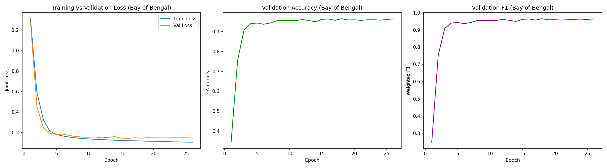
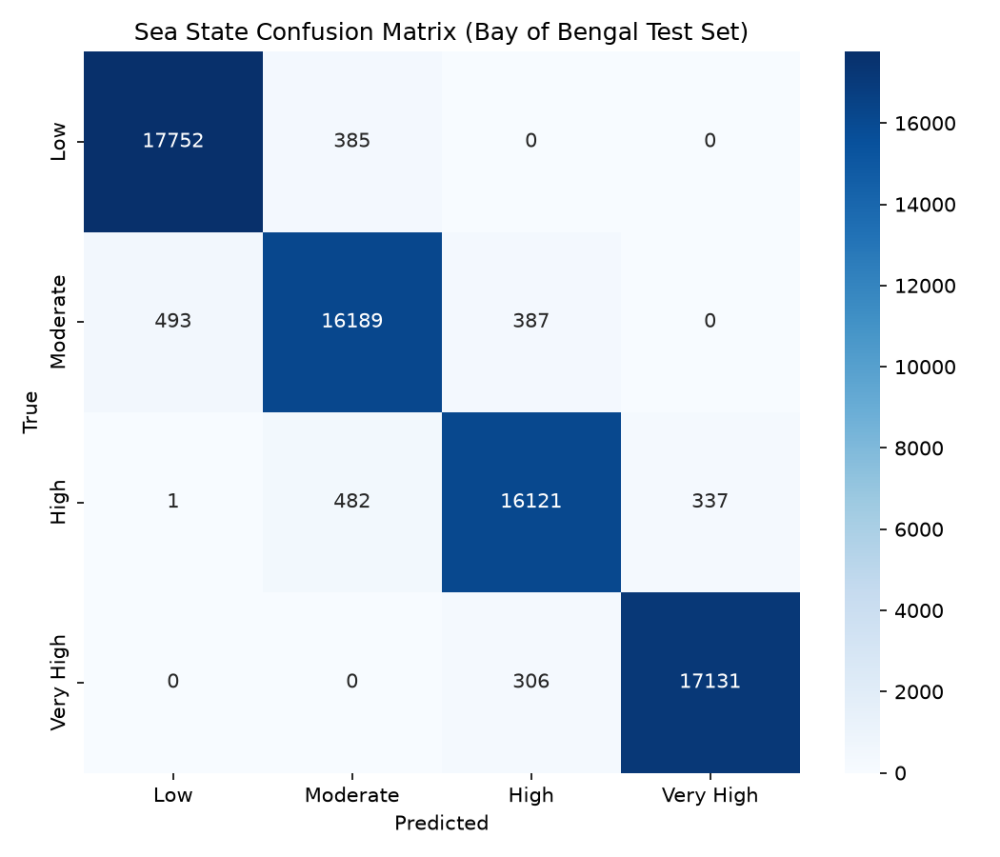
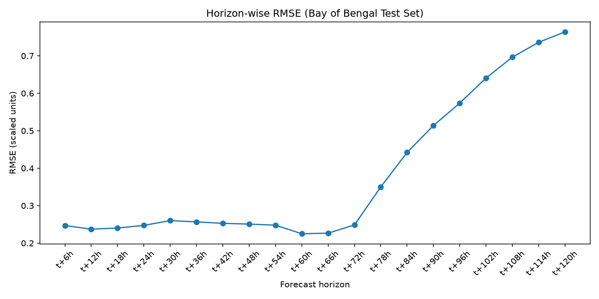

# Bay of Bengal — PatchTST Wave Forecasting: Documentation & Report

**Status:** PatchTST results complete. Mamba comparison (Section 7) is held pending Phase 13, which will run once all four oceans are complete — see note in that section.

---

## 1. Overview

This report documents the PatchTST half of a dual-task ocean wave forecasting model, trained and evaluated on 26 years (2000-2026) of hourly ERA5 reanalysis data at a fixed Bay of Bengal point (buoy BD08: 17.833N, 89.216E). The model performs two tasks from a single shared representation:

1. **Classification** - predicts a sea-state category (Low / Moderate / High / Very High mean wave period) at the next timestep
2. **Forecasting** - predicts significant wave height (`swh`), mean wave period (`mwp`), and mean wave direction (`mwd`) for 20 future timesteps, 6-hourly out to 120 hours ahead

Bay of Bengal is the third of four oceans in this project (after Atlantic and Pacific, alongside Arabian Sea), reusing the identical pipeline structure, input channels, split boundary logic, and model architecture - with its own independently-computed classification bin edges and its own scaler, per the project's multi-ocean design.

---

## 2. Architecture

Identical to the Atlantic model - same `PatchTST` class, same hyperparameters, only the trained weights differ.

- Input: `[batch, 72, 6]` (`u10, v10, swh, mwp, sin_mwd, cos_mwd`)
- Patch embedding: patch_size=12, stride=6, 11 patches, linear projection to `d_model=128`
- Transformer encoder: 4 layers, 8 heads, `ff_dim=256`, dropout=0.1
- Global average pooling -> classification head (4 classes) + forecasting head (20x3)
- 548,928 trainable parameters (same as Atlantic/Pacific - architecture is ocean-agnostic)

### Mamba (teammate's model)

*Held pending Phase 13, same as Atlantic/Pacific's reports - the comparison is being done once for all four oceans together.*

---

## 3. Variable Definitions & Formulas

Identical to Atlantic - see `docs/formulas.md` for full detail and citations. Tm01 (`mwp`) is the sole period definition used; Tp was reviewed and excluded. Only `mwd` gets sin/cos circular encoding (`mdts`/`mdww` are not available in the ERA5 product used, same limitation as Atlantic/Pacific).

---

## 4. Data Pipeline Summary

| Stage | Result |
|---|---|
| Raw merge | 232,344 hourly rows, 2000-01-01 to 2026-07-03 - same row count and date range as Atlantic/Pacific |
| Cleaning | 0 duplicate timestamps, 0 missing timestamps, 0 rows dropped |
| Feature engineering | `sin_mwd`/`cos_mwd` added; unit-circle check passed (deviation ~2.22e-16) |
| Labels | **Bay of Bengal's own** quartile bin edges: `[4.509097, 7.7588763, 8.6737255, 9.79438075, 15.519651]` - perfectly balanced 25.00% per class. Mean wave period 8.81s |
| Split | Chronological 70/30 - train 162,640 rows, test 69,704 rows - identical index split to Atlantic/Pacific |
| Normalization | `StandardScaler` fit on train only, saved as `scaler_bay_of_bengal.pkl` (independent from other oceans' scalers) |
| Windowing | 162,520 train windows, 69,584 test windows - identical shapes to Atlantic/Pacific |

---

## 5. Training Results

- Best checkpoint: **epoch 16** (early stopping patience=10, training ran to epoch 26)
- Validation loss: **0.1418**
- Validation accuracy: **96.41%**, weighted F1: **96.41%**
- Validation forecast RMSE: **0.4392** (scaled units)
- Trained on Google Colab's free T4 GPU tier
- Consistent with Atlantic (96.19%) and Pacific (96.40%) training results - the architecture continues to generalize well across a third, distinct ocean wave climate

---

## 6. Test Set Evaluation Results

All metrics computed on the true held-out test set (69,584 windows, 2018-2026) - never used in training or the internal validation slice.

**Classification**

| Metric | Value |
|---|---|
| Accuracy | 96.56% |
| Weighted F1 | 96.56% |
| Macro F1 | 96.54% |

| Class | Precision | Recall | F1 |
|---|---|---|---|
| Low | 0.9729 | 0.9788 | 0.9758 |
| Moderate | 0.9492 | 0.9484 | 0.9488 |
| High | 0.9588 | 0.9516 | 0.9552 |
| Very High | 0.9807 | 0.9825 | 0.9816 |

**Forecasting** (overall: MAE 0.2091, RMSE 0.4274, R2 0.8259, scaled units)

| Horizon | RMSE | R2 |
|---|---|---|
| t+6h | 0.2469 | 0.9419 |
| t+24h | 0.2473 | 0.9417 |
| t+48h | 0.2507 | 0.9401 |
| t+72h | 0.2485 | 0.9412 |
| t+96h | 0.5738 | 0.6862 |
| t+120h | 0.7641 | 0.4435 |

Same expected pattern as Atlantic/Pacific - error stays low and stable through t+72h, then rises sharply from t+78h onward. Bay of Bengal's forecast skill at t+120h (R2 0.44) sits between Atlantic's (0.27) and Pacific's (0.35), suggesting comparable persistence in wave patterns at this location.

**Extended validation metrics (real units, inverse-transformed via scaler):**

| Variable | Correlation (r) | Scatter Index | Bias | RMSE |
|---|---|---|---|---|
| swh | 0.9521 | 0.1477 | -0.0112 | 0.2233 m |
| mwp | 0.9047 | 0.0759 | -0.0020 | 0.6672 s |
| mwd | 0.8741 | 0.1362 | -0.0952 | 24.4528 deg |

**Year-by-year stability:** accuracy stayed within a 95.8%-97.2% band across every year from 2018 through 2026, with no degrading trend.

---

## 7. Comparison with Mamba

**Held pending Phase 13.** Same as the Atlantic/Pacific reports - done once for all four oceans together, after all are complete.

---

## 8. Conclusion (Bay of Bengal, PatchTST - partial)

The PatchTST model performs very strongly on the Bay of Bengal dataset - 96.56% classification accuracy, in line with Atlantic's 96.39% and Pacific's 96.87%, with forecast R2 holding above 0.94 through 72 hours before degrading at the longest horizons. Performance is stable across the full 8-year test period, with no meaningful concept drift. Combined with Atlantic and Pacific's results, this continues to strongly support that the PatchTST architecture transfers well across different ocean wave climates without architecture changes - only the data-derived bin edges and scaler need to be ocean-specific. Full conclusions comparing against Mamba, and across all four oceans, will follow once Phase 13 is complete.
