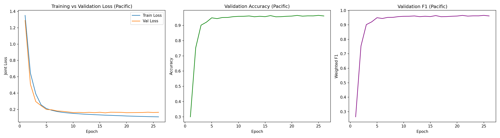
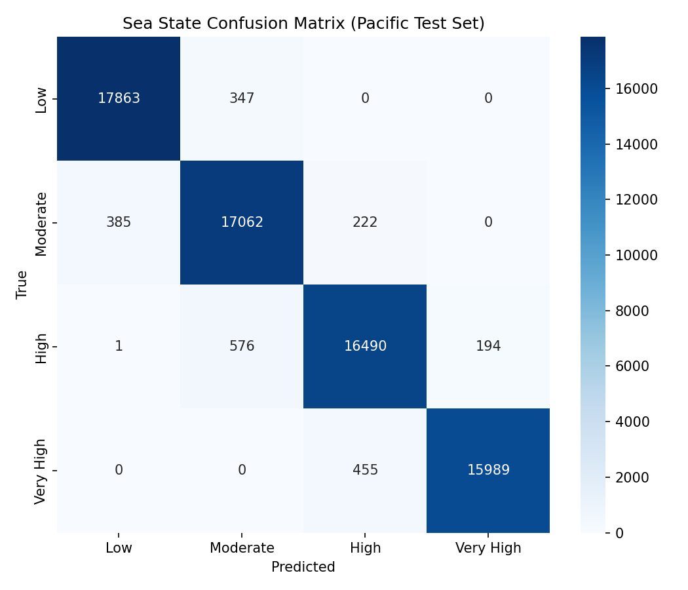
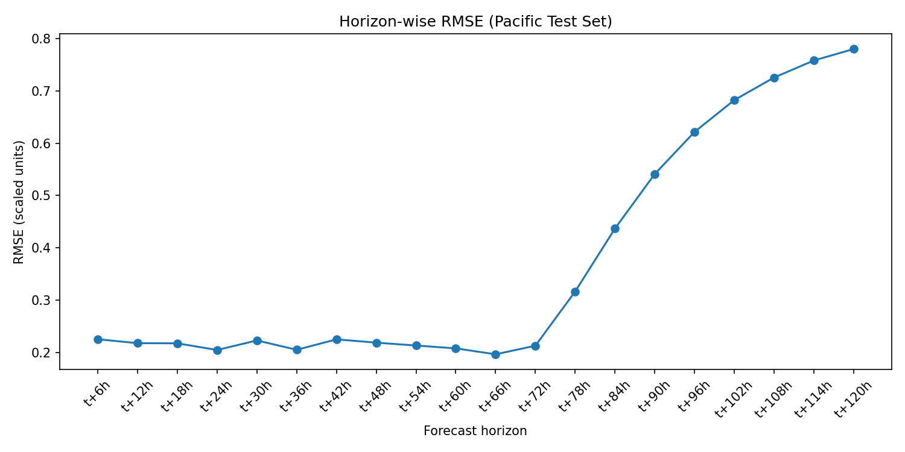

# Pacific Ocean — PatchTST Wave Forecasting: Documentation & Report

**Status:** PatchTST results complete. Mamba comparison (Section 7) is held pending Phase 13, which will run once Indian ocean is also complete — see note in that section.

---

## 1. Overview

This report documents the PatchTST half of a dual-task ocean wave forecasting model, trained and evaluated on 26 years (2000–2026) of hourly ERA5 reanalysis data at a fixed Pacific point. The model performs two tasks from a single shared representation:

1. **Classification** — predicts a sea-state category (Low / Moderate / High / Very High mean wave period) at the next timestep
2. **Forecasting** — predicts significant wave height (`swh`), mean wave period (`mwp`), and mean wave direction (`mwd`) for 20 future timesteps, 6-hourly out to 120 hours ahead

Pacific is the second of three oceans in this project (after Atlantic, before Indian), reusing the identical pipeline structure, input channels, split boundary logic, and model architecture — with its own independently-computed classification bin edges and its own scaler, per the project's multi-ocean design.

---

## 2. Architecture

Identical to the Atlantic model — same `PatchTST` class, same hyperparameters, only the trained weights differ.

- Input: `[batch, 72, 6]` (`u10, v10, swh, mwp, sin_mwd, cos_mwd`)
- Patch embedding: patch_size=12, stride=6, 11 patches, linear projection to `d_model=128`
- Transformer encoder: 4 layers, 8 heads, `ff_dim=256`, dropout=0.1
- Global average pooling → classification head (4 classes) + forecasting head (20×3)
- 548,928 trainable parameters (same as Atlantic — architecture is ocean-agnostic)

### Mamba (teammate's model)

*Held pending Phase 13, same as Atlantic's report — the comparison is being done once for all three oceans together.*

---

## 3. Variable Definitions & Formulas

Identical to Atlantic — see `docs/formulas.md` for full detail and citations. Tm01 (`mwp`) is the sole period definition used; Tp was reviewed and excluded. Only `mwd` gets sin/cos circular encoding (`mdts`/`mdww` are not available in the ERA5 product used, same limitation as Atlantic).

---

## 4. Data Pipeline Summary

| Stage | Result |
|---|---|
| Raw merge | 232,344 hourly rows, 2000-01-01 to 2026-07-03 — same row count and date range as Atlantic |
| Cleaning | Already complete — 0 duplicate timestamps, 0 missing timestamps, 0 rows dropped |
| Feature engineering | `sin_mwd`/`cos_mwd` added; unit-circle check passed (deviation ~1e-16) |
| Labels | **Pacific's own** quartile bin edges: `[5.750778, 7.5365458, 8.3817325, 9.60272075, 16.787636]` — perfectly balanced 25.00% per class. Notably higher mean wave period (8.75s) than Atlantic (7.85s) |
| Split | Chronological 70/30 — train 162,640 rows, test 69,704 rows — identical index split to Atlantic |
| Normalization | `StandardScaler` fit on train only, saved as `scaler_pacific.pkl` (independent from Atlantic's scaler) |
| Windowing | 162,520 train windows, 69,584 test windows — identical shapes to Atlantic |

---

## 5. Training Results

- Best checkpoint: **epoch 16** (early stopping patience=10, up to 100 epochs allowed)
- Validation loss: **0.1579**
- Validation accuracy: **96.40%**, weighted F1: **96.41%**
- Validation forecast RMSE: **0.4724** (scaled units)
- Trained on Google Colab's free T4 GPU tier
- Very close to Atlantic's training results (96.19%/96.19%/0.4704) — the architecture generalizes well across the two oceans' different wave climates

---

## 6. Test Set Evaluation Results

All metrics computed on the true held-out test set (69,584 windows, 2018–2026) — never used in training or the internal validation slice.

**Classification**

| Metric | Value |
|---|---|
| Accuracy | 96.87% |
| Weighted F1 | 96.87% |
| Macro F1 | 96.88% |

| Class | Precision | Recall | F1 |
|---|---|---|---|
| Low | 0.9788 | 0.9809 | 0.9799 |
| Moderate | 0.9487 | 0.9656 | 0.9571 |
| High | 0.9606 | 0.9553 | 0.9579 |
| Very High | 0.9880 | 0.9723 | 0.9801 |

**Forecasting** (overall: MAE 0.2278, RMSE 0.4299, R² 0.8037, scaled units)

| Horizon | RMSE | R² |
|---|---|---|
| t+6h | 0.2254 | 0.9460 |
| t+24h | 0.2048 | 0.9554 |
| t+48h | 0.2189 | 0.9491 |
| t+72h | 0.2129 | 0.9518 |
| t+96h | 0.6216 | 0.5896 |
| t+120h | 0.7801 | 0.3537 |

Same expected pattern as Atlantic — error stays low and stable through t+72h, then rises sharply from t+78h onward. Notably, **Pacific retains forecast skill slightly longer than Atlantic** (R² 0.35 at t+120h vs. Atlantic's 0.27), suggesting somewhat more persistent wave patterns at this Pacific location.

**Year-by-year stability:** accuracy stayed within a 95.8%–97.6% band across every year from 2018 through 2026, with no degrading trend.

---

## 7. Comparison with Mamba

**⏸ Held pending Phase 13.** Same as the Atlantic report — done once for all three oceans together, after Indian is also complete.

---

## 8. Conclusion (Pacific, PatchTST — partial)

The PatchTST model performs very strongly on the Pacific dataset — 96.87% classification accuracy, slightly ahead of Atlantic's 96.39%, and forecast R² holding above 0.94 through 72 hours before degrading, with somewhat better retention at the longest horizons than Atlantic. Performance is stable across the full 8-year test period. Combined with Atlantic's results, this is a strong early signal that the PatchTST architecture transfers well across different ocean wave climates without architecture changes — only the data-derived bin edges and scaler need to be ocean-specific. Full conclusions comparing against Mamba, and across all three oceans, will follow once Phase 13 is complete.